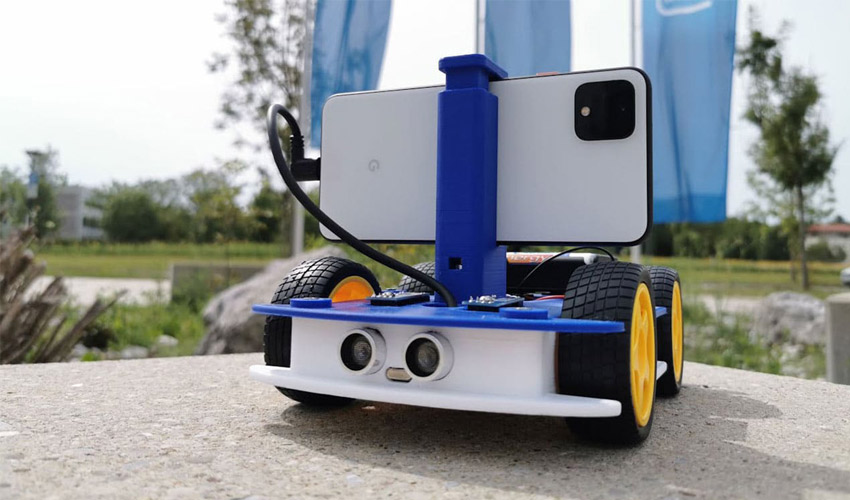

# robotics-and-vision
Utilisation de l'IoT pour la robotique

Sur la base d'un bot : https://www.openbot.org/
https://www.3dnatives.com/en/openbot-by-intel-080920206/#!

Est ce qu'on peut refaire pareil avec un ESP32 ?
et si on peut se balader s'en servir comme d'un epouvantail 
à oiseaux ou autres 

Ensuite ... mais faudrait vraiment etre motivé ... envisager une flotte 
de bot.

PS : il y a un peu de mécanique .. faut aimer les légos ! 
